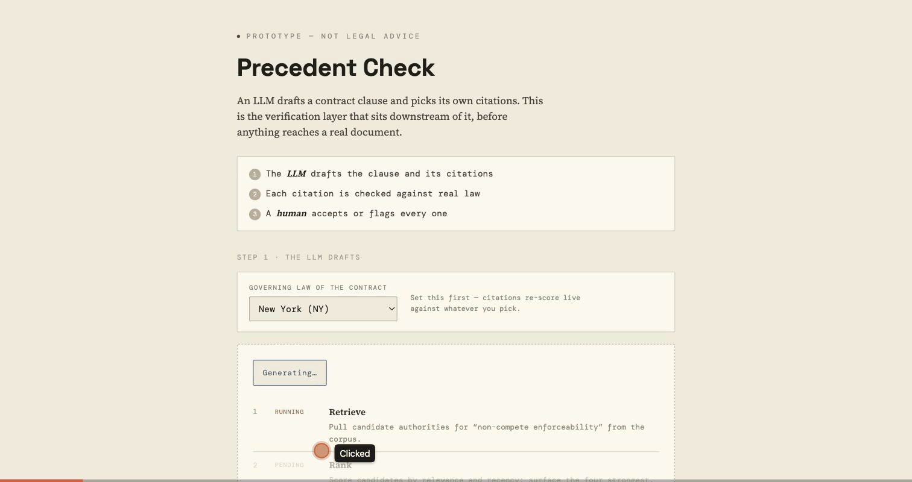

# Precedent Check



A citation-verification prototype for AI-drafted legal documents. An LLM
drafts a clause and picks its own citations. Before that citation reaches a
real document, it has to survive one question: does it hold up where the
document will be used? Binding, merely persuasive, or beside the point.

Live: **[precedent-check.pages.dev](https://precedent-check.pages.dev)**

## Why this exists

AI-fabricated legal citations are not a hypothetical problem. A public
tracker maintained by Damien Charlotin (HEC Paris) has catalogued over
1,500 court cases involving AI-fabricated citations as of mid-2026, up
roughly 8x in a year. Real sanctions and at least one indefinite license
suspension are attached to that number. This prototype sits between an
LLM's citation and a document that gets filed: verify, show the evidence,
a human decides.

Three decisions carry the point:

1. **The LLM's process is legible.** The drafting sequence (retrieve, rank,
   draft, self-check, escalate) steps through visibly, and the draft text
   appears attached to the moment it's written, not as a disconnected
   reveal afterward.
2. **Nothing is accepted without a human.** The review-queue gate mirrors a
   "Review Gatekeeper" pattern from a 9-agent job-application pipeline
   built earlier, applied here to citations instead of applications.
3. **The graph is real, not staged for the UI.** The citation dataset was
   loaded into a local Neo4j 5 instance and queried with real Cypher. The
   output shown in "How this was verified" is copied from that run.

## Data provenance

8 real opinions pulled live from the [CourtListener REST API v4](https://www.courtlistener.com/help/api/rest/)
(Free Law Project), public-domain court text: real case names, courts,
dates, reporter citations, and CourtListener URLs. The one `CITES` edge
(BDO Seidman v. Hirshberg to Karpinski v. Ingrasci) was confirmed from the
citing opinion's own citation data, not asserted by hand. Jurisdiction
characterizations (7 states) are simplified for this demo. Nothing here is
legal advice.

## What it does

1. Pick the contract's governing law.
2. Click **Generate draft with AI**. Watch the drafting sequence run, then
   the clause appears with four inline citations.
3. Click a citation to see its real source text and why it scored binding,
   persuasive, or blocked against whichever jurisdiction is selected.
4. Accept or flag it. Nothing is final until you do.
5. Expand **How this was verified** for the real Cypher queries that ran
   against a local Neo4j graph built from this same data.

## Stack

React 19, TypeScript, Vite. No backend, no external network calls at
runtime: all data is embedded and pre-verified. Design tokens follow the
"lightMuseum" house system: warm paper ground, engraved hairlines, DM Mono
plus Space Grotesk plus Source Serif 4.

## Development

```bash
npm install
npm run dev            # app at localhost:5173
npm run build           # type-check + production build
npm run storybook       # component stories at localhost:6006
npm run build-storybook
npm run deploy           # build + wrangler pages deploy
```

Component stories live next to their components (`src/components/*.stories.tsx`):
`CiteChip`, `StatusBanner`, `ExhibitCard`, `ReviewQueue`, `AgentTrace`.
